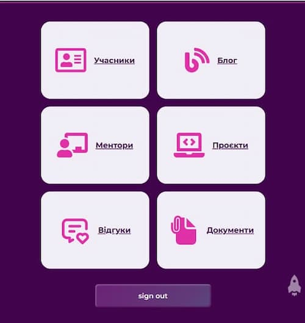
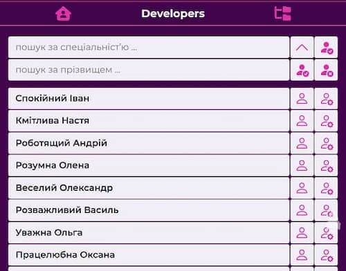
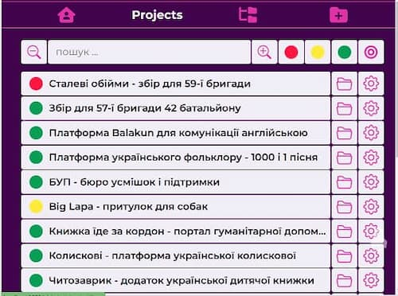
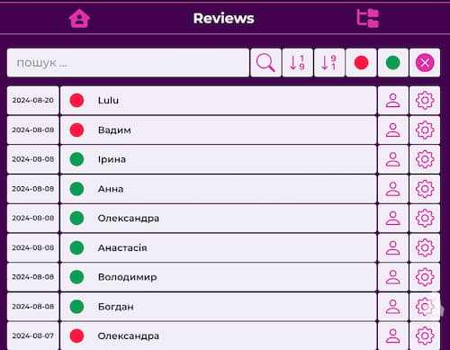
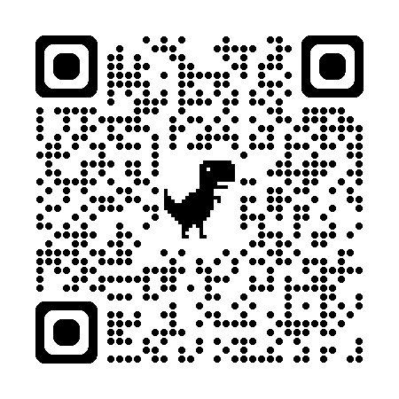

# Baza Trainee Ukraine

## _Проєкт створено завдяки громадської організації  [Baza Trainee Ukraine](https://baza-trainee.tech/ua), яка сприяє отриманню першого досвіду роботи тим, хто починає свій шлях в ІТ._

### Додаток створений за допомогою фреймворка [Next.js](https://nextjs.org/) та опублікований на [Vercel Platform](https://vercel.com/new?utm_medium=default-template&filter=next.js&utm_source=create-next-app&utm_campaign=create-next-app-readme)

---
---
---

### Застосовані

- Анімація на головній сторінці - бібліотека [Framer Motion](https://www.framer.com/motion/)
- Інтернаціоналізація [i18next](https://www.i18next.com/)
- База даних [MongoDB Atlas](https://www.mongodb.com/cloud/atlas/register)
- Інтерфейс до бази данних [Mongoose](https://mongoosejs.com/)
- Авторизація користувача [Auth.js](https://authjs.dev/)
- Для взаємодії з базою даних на стороні фронтенда  _formData_ та _actions_

#### Проєкт складається з двох частин. Перша частина - це інтерфейс користувача, друга - інтерфейс адміністратора. Можливості Next.js дозволяють використовувати frontend та backend в одному додатку

---
---

#### Приклад підключення

``` import mongoose from "mongoose";
export const uri = process.env.MONGODB_URI;

const clientOptions = {
  serverApi: { version: "1", strict: true, deprecationErrors: true },
};

export const connectDB = async () => {
  try {
    const { connection } = await mongoose.connect(uri, clientOptions);
    if (connection.readyState === 1) {
      console.log(
        "Pinged your deployment. You successfully connected to MongoDB!"
      );
      return Promise.resolve(true);
    }
  } catch (error) {
    console.error(error);
    return Promise.reject(error);
  }
}; ```
```

---

#### Приклади інтерфейсу адміністратора









---

#### В проєкті реалізовані пошук та фільтрація за словом, датою, статусом. Доступний перегляд компонента безпосередньо в частині адміністратора, також редагування та видалення

---
---
---

#### Getting Started

```bash
npm start
```

#### First, run the development server

```bash
npm run dev
# or
yarn dev
# or
pnpm dev
# or
bun dev
```



---

---

---
